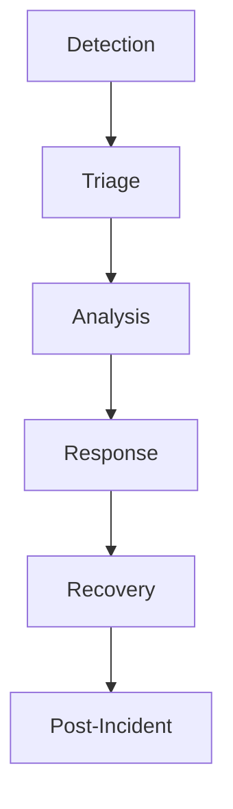

# SOAR Automation

SecuClaw provides Security Orchestration, Automation, and Response (SOAR) capabilities for automated security operations.

## Overview



## Playbooks

### Phishing Response

```json5
{
  soar: {
    playbooks: {
      phishing: {
        name: "Phishing Investigation",
        trigger: "alert.type = 'phishing'",
        steps: [
          {
            name: "Extract IOCs",
            action: "extract_indicators",
          },
          {
            name: "Check Reputation",
            action: "query_threat_intel",
          },
          {
            name: "Analyze Headers",
            action: "analyze_email_headers",
          },
          {
            name: "Quarantine",
            action: "quarantine_email",
            condition: "severity >= high",
          },
        ],
      },
    },
  },
}
```

### Malware Containment

```json5
{
  soar: {
    playbooks: {
      malware: {
        name: "Malware Containment",
        trigger: "alert.type = 'malware'",
        steps: [
          {
            name: "Isolate Endpoint",
            action: "isolate_endpoint",
            condition: "severity = critical",
          },
          {
            name: "Collect Forensics",
            action: "collect_evidence",
          },
          {
            name: "Scan Network",
            action: "network_scan",
          },
        ],
      },
    },
  },
}
```

## Automation Actions

| Action | Description |
|--------|-------------|
| `isolate_endpoint` | Isolate compromised host |
| `block_ip` | Block malicious IP |
| `quarantine_file` | Quarantine malicious file |
| `create_ticket` | Create incident ticket |
| `notify` | Send notifications |
| `collect_evidence` | Gather forensic data |
| `scan_endpoint` | Run EDR scan |

## Triggers

```json5
{
  soar: {
    triggers: [
      {
        name: "High Severity Alert",
        condition: "alert.severity >= high",
        playbook: "phishing",
      },
      {
        name: "Critical Alert",
        condition: "alert.severity = critical",
        playbook: "malware",
      },
    ],
  },
}
```

## Configuration

```json5
{
  soar: {
    enabled: true,
    maxConcurrentRuns: 5,
    timeout: "30m",
    notification: {
      channels: ["email", "slack"],
    },
  },
}
```

---

_Related: [Configuration](/gateway/configuration)_
