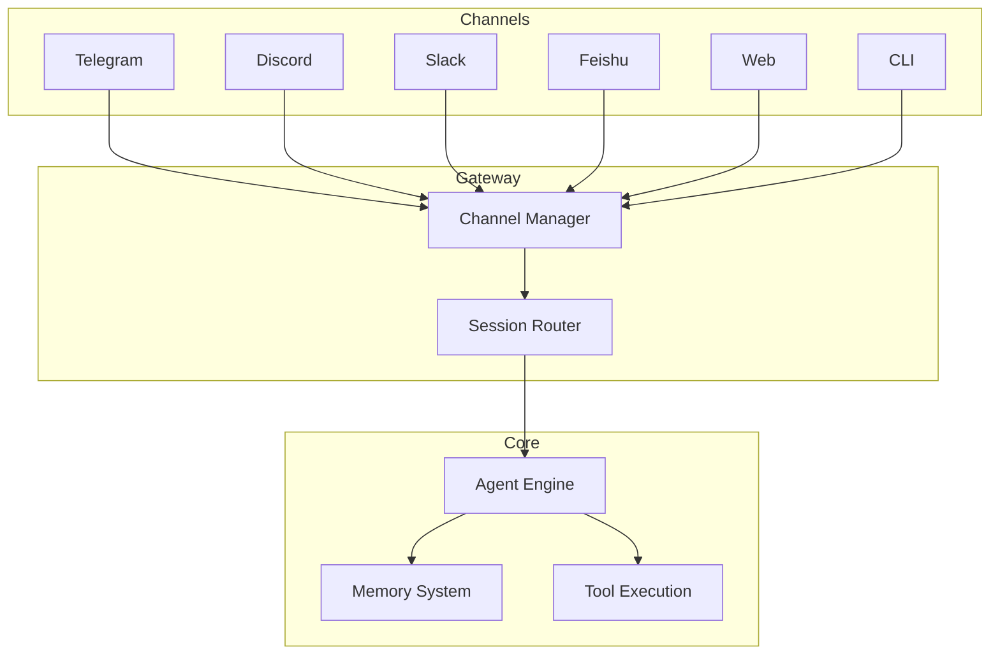

# Messaging Channels

SecuClaw supports multiple messaging channels for security operations, allowing you to interact with AI security agents through your preferred platform.

## Supported Channels

<Columns>
  <Card title="Telegram" href="/channels/telegram" icon="message">
    Bot API with DM and group support.
  </Card>
  <Card title="Discord" href="/channels/discord" icon="hash">
    Bot API with guild channel support.
  </Card>
  <Card title="Slack" href="/channels/slack" icon="slack">
    Socket Mode bot for workspaces.
  </Card>
  <Card title="Feishu/Lark" href="/channels/feishu" icon="users">
    Enterprise messaging platform.
  </Card>
  <Card title="Web" href="/web/console" icon="globe">
    Browser-based security console.
  </Card>
  <Card title="CLI" href="/cli" icon="terminal">
    Command-line interface.
  </Card>
</Columns>

## Quick Setup

### 1. Choose your channel

Each channel has specific setup requirements:

| Channel | Auth Method | Use Case |
|---------|-------------|----------|
| Telegram | Bot Token | Personal/group security alerts |
| Discord | Bot Token | Team security operations |
| Slack | Bot Token + App Token | Enterprise workflows |
| Feishu | App ID + Secret | Chinese enterprise users |

### 2. Configure the channel

```bash
secuclaw channels add
```

Follow the interactive wizard to configure your chosen channel.

### 3. Start the gateway

```bash
secuclaw gateway
```

### 4. Pair your device

By default, new users must pair their device:

```bash
secuclaw pairing list <channel>
secuclaw pairing approve <channel> <CODE>
```

## Common Configuration

### DM Policy

All channels support `dmPolicy` for controlling direct message access:

- `pairing` (default) - Users must pair their device
- `allowlist` - Only allowlisted users can message
- `open` - Anyone can message (requires `"*"` in allowFrom)
- `disabled` - Disable direct messages

### Group Policy

For channels with group chat support:

- `open` - Allow all group messages
- `allowlist` - Only specific groups/channels allowed
- `disabled` - Disable group messages

### Mention Requirements

Control whether the bot responds only when mentioned:

```json5
{
  channels: {
    telegram: {
      groups: {
        "*": { requireMention: true },
      },
    },
  },
}
```

## Channel Features

| Feature | Telegram | Discord | Slack | Feishu |
|---------|----------|---------|-------|--------|
| Direct Messages | ✅ | ✅ | ✅ | ✅ |
| Group Chats | ✅ | ✅ | ✅ | ✅ |
| File Attachments | ✅ | ✅ | ✅ | ✅ |
| Streaming | ✅ | ✅ | ✅ | ✅ |
| Reactions | ✅ | ✅ | ✅ | ⚠️ |
| Threads | ⚠️ | ✅ | ✅ | ⚠️ |

## Multi-Channel Architecture



## Channel Configuration Reference

### Common Fields

| Field | Description | Default |
|-------|-------------|---------|
| `enabled` | Enable/disable channel | `true` |
| `dmPolicy` | Direct message policy | `pairing` |
| `allowFrom` | User allowlist | - |
| `groupPolicy` | Group message policy | `allowlist` |
| `textChunkLimit` | Max message length | varies |
| `mediaMaxMb` | Max media file size | varies |

### Channel-Specific Docs

- [Telegram Configuration](/channels/telegram)
- [Discord Configuration](/channels/discord)
- [Slack Configuration](/channels/slack)
- [Feishu Configuration](/channels/feishu)

## Security Data Sources

For security data integration (SIEM, EDR, Firewall), see [Threat Intelligence](/threat-intel).

---

_Related: [Gateway Configuration](/gateway/configuration) | [Troubleshooting](/help/troubleshooting)_
