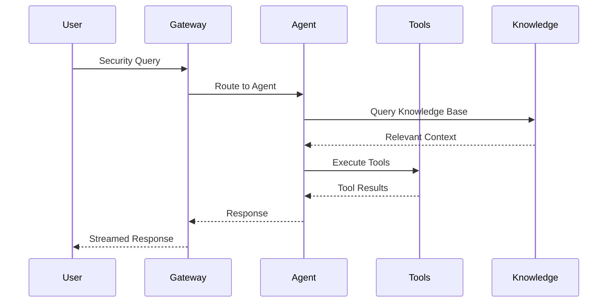

# Architecture

Last updated: 2026-02-21

## Overview

SecuClaw is built on a modular architecture designed for enterprise security operations. The system consists of several key components that work together to provide comprehensive security capabilities.

## System Architecture

```mermaid
flowchart TB
    subgraph Clients["Clients"]
        CLI[CLI]
        Web[Web Console]
        API[REST API]
        Webhook[Webhooks]
    end
    
    subgraph Gateway["SecuClaw Gateway"]
        Router[Request Router]
        Auth[Authentication]
        Protocol[Protocol Handler]
    end
    
    subgraph Core["Core Engine"]
        Agent[Agent Engine]
        Session[Session Manager]
        Memory[Memory System]
        Skills[Skills System]
    end
    
    subgraph Tools["Tools & Integration"]
        Sandbox[Sandbox]
        Tools[Security Tools]
        VectorDB[Vector Database]
    end
    
    subgraph Data["Data Sources"]
        SIEM[SIEM]
        Firewall[Firewall]
        EDR[EDR/XDR]
        Cloud[Cloud Security]
    end
    
    subgraph Knowledge["Knowledge Base"]
        ATTACK[MITRE ATT&CK]
        SCF[SCF 2025]
        Intel[Threat Intel]
    end
    
    Clients --> Gateway
    Gateway --> Core
    Core --> Tools
    Core --> Data
    Core --> Knowledge
```

## Components

### Gateway (Daemon)

The Gateway is the central hub that manages all security operations.

**Responsibilities:**
- Request routing and load balancing
- Authentication and authorization
- Protocol handling
- Session management
- Event processing

**Features:**
- WebSocket-based communication
- Configurable port (default: 21000)
- Token-based authentication
- Hot configuration reload

### Agent Engine

The core AI engine that powers security operations.

**Capabilities:**
- Multi-model LLM support
- Tool execution and orchestration
- Context management
- Streaming responses

**Supported Models:**
- Anthropic Claude
- OpenAI GPT
- Ollama (local)
- And more via providers

### Session Manager

Manages conversation sessions and context.

**Features:**
- JSONL-based persistent storage
- Session compaction
- Context pruning
- Multi-agent isolation

### Memory System

Hybrid search memory for knowledge retrieval.

**Features:**
- Vector similarity search (ChromaDB)
- BM25 full-text search
- Hybrid ranking
- Knowledge graph support

### Skills System

Extensible skill framework for custom capabilities.

**Features:**
- Dynamic skill loading
- Skill registry
- Capability discovery
- Skill marketplace (SecuHub)

**Architecture Decision:** SecuClaw uses **8 Skills** (not 8 Agents) for role composition. See [Skills vs Agents](/architecture-skills-vs-agents) for the design rationale.

**Visualization Support:** Skills can carry their own visualizations. See [Visualization-Enabled Skills](/visualization-enabled-skills) for details.

### Sandbox

Secure execution environment for tools.

**Features:**
- Docker-based isolation
- Resource limits
- Network policies
- File system restrictions

### Security Tools

Built-in security analysis tools.

**Categories:**
- Attack simulation
- Defense assessment
- Security analysis
- Vulnerability assessment

### Knowledge Base

Integrated security knowledge frameworks.

**Frameworks:**
- MITRE ATT&CK (Enterprise, Mobile, ICS)
- SCF 2025 (33 security domains)
- STIX 2.1 threat intelligence

## Data Flow



## Deployment Patterns

### Standalone

Single Gateway instance for small deployments.

```
┌─────────────────┐
│   Gateway       │
│   (Port 21000) │
└─────────────────┘
```

### Clustered

Multiple Gateway instances for high availability.

```
┌─────────────┐
│  Load       │
│  Balancer   │
└──────┬──────┘
       │
┌──────┴──────┐
│   Gateway   │
│   Node 1    │
├─────────────┤
│   Gateway   │
│   Node 2    │
├─────────────┤
│   Gateway   │
│   Node 3    │
└─────────────┘
```

### Distributed

Distributed deployment for large enterprises.

```
┌─────────────────────────────────────┐
│           Load Balancer             │
└──────────────┬──────────────────────┘
               │
┌──────────────┼──────────────────────┐
│              │                      │
▼              ▼                      ▼
┌──────────┐  ┌──────────┐      ┌──────────┐
│ Region 1 │  │ Region 2 │      │ Region N │
│ Gateway  │  │ Gateway  │      │ Gateway  │
└──────────┘  └──────────┘      └──────────┘
```

## Security

### Authentication

- Token-based authentication
- OAuth support for providers
- API key management

### Authorization

- Role-based access control
- Session isolation
- Channel permissions

### Data Protection

- Encryption at rest
- TLS for transport
- Secure credential storage

## Operations

- **Start**: `secuclaw gateway`
- **Health**: `secuclaw health`
- **Logs**: `secuclaw logs`
- **Config**: `secuclaw configure`

---

_Related: [Configuration](/gateway/configuration) · [Security](/security/overview) · [Tools](/tools) · [ROADMAP](/ROADMAP)_

---

## Implementation Status

| Component | Status | Notes |
|-----------|--------|-------|
| Gateway | ✅ Complete | HTTP + WebSocket |
| Agent Engine | ✅ Complete | Dual-loop, 16 event types |
| Session Manager | ✅ Complete | JSONL persistence |
| Memory System | ✅ Complete | Vector + BM25 + Decay |
| Knowledge Graph | ✅ Complete | 4 graph types |
| MITRE ATT&CK | ✅ Complete | v18.1 STIX data |
| SCF 2025 | ✅ Complete | 33 domains mapped |
| LLM Providers | ⚠️ 36% | 9 of 22+ implemented |
| Skills System | ⚠️ 80% | Layering incomplete |
| CLI | ⚠️ 60% | Commands are stubs |
| Web Interface | ✅ 95% | Nearly complete |
| Message Channels | ⚠️ Partial | Web only complete |

**Overall Completion: ~86%**
