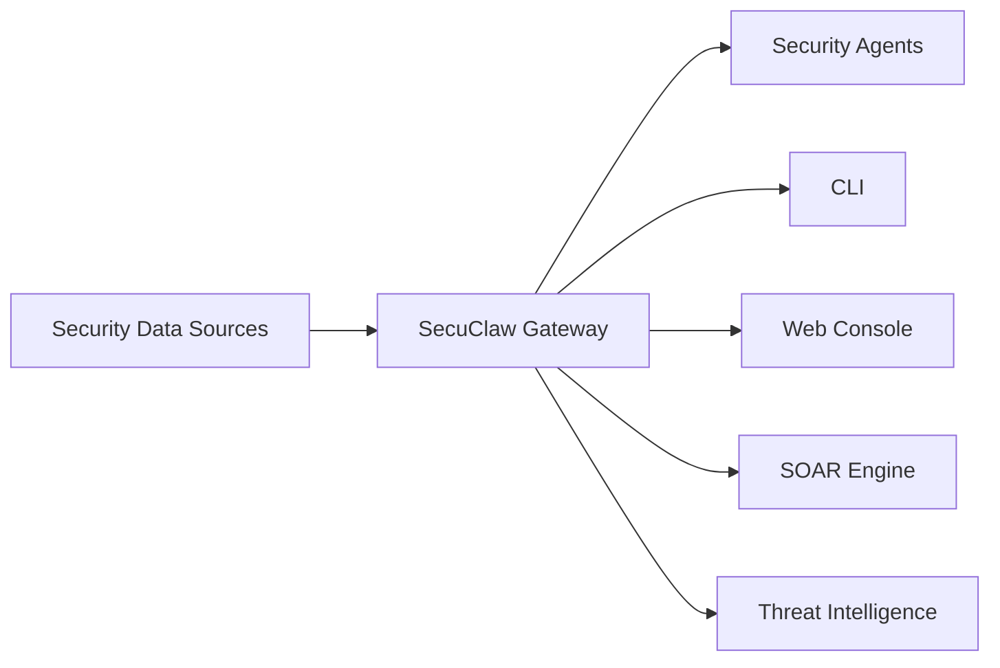

# SecuClaw 🛡️

<p align="center">
    
    
</p>

> _"Guardian Claws, Intelligent Defense for Tomorrow"_ — SecuClaw

<p align="center">
  <strong>AI-driven enterprise security operations platform with autonomous threat detection, compliance management, and security automation.</strong><br />
  Protect your organization with AI-powered security operations, real-time threat intelligence, and automated response workflows.
</p>

<Columns>
  <Card title="Get Started" href="/start/getting-started" icon="rocket">
    Install SecuClaw and set up your security operations in minutes.
  </Card>
  <Card title="Security Roles" href="/concepts/security-roles" icon="shield">
    Explore specialized AI security agents for different operational needs.
  </Card>
  <Card title="Security Console" href="/web/console" icon="layout-dashboard">
    Launch the browser dashboard for threat monitoring and incident response.
  </Card>
</Columns>

## What is SecuClaw?

SecuClaw is an **AI-driven enterprise security operations platform** that combines 20 years of security industry expertise with cutting-edge AI technology. It provides comprehensive security operations capabilities including:

- **Autonomous Threat Detection**: AI-powered analysis of security events
- **Compliance Management**: Automated regulatory compliance monitoring
- **Security Automation**: SOAR-style automated response workflows
- **Threat Intelligence**: Integrated global threat intelligence feeds
- **Multi-Role Security Operations**: Specialized AI agents for different security functions

**Who is it for?** Enterprise security teams, SOC analysts, CISOs, and compliance officers who need an AI-powered assistant to enhance their security operations.

**What makes it different?**

- **AI-Native**: Built specifically for security operations with specialized AI agents
- **Enterprise-Grade**: SOC 2, ISO 27001 ready architecture
- **Self-Hosted**: Full control over your security data
- **Multi-Language Support**: Global deployment with EN/CN localization

**What do you need?** Node 22+, an API key (Anthropic recommended), and 5 minutes.

## How it works



The Gateway is the central hub for security data processing, agent orchestration, and incident response.

## Key capabilities

<Columns>
  <Card title="Multi-Agent Security" icon="users">
    Specialized security agents: SEC, SEC+LEG, SEC+IT, SEC+BIZ, and more.
  </Card>
  <Card title="Threat Detection" icon="radar">
    AI-powered real-time threat detection and analysis.
  </Card>
  <Card title="Compliance Engine" icon="file-check">
    Automated compliance monitoring and reporting.
  </Card>
  <Card title="SOAR Automation" icon="workflow">
    Automated security incident response workflows.
  </Card>
  <Card title="Threat Intelligence" icon="database">
    Integrated global threat intelligence feeds.
  </Card>
  <Card title="Security Console" icon="monitor">
    Browser dashboard for monitoring and response.
  </Card>
</Columns>

## Quick start

<Steps>
  <Step title="Install SecuClaw">
    ```bash
    npm install -g secuclaw@latest
    ```
  </Step>
  <Step title="Configure your environment">
    ```bash
    secuclaw init
    secuclaw configure
    ```
  </Step>
  <Step title="Start the Security Gateway">
    ```bash
    secuclaw gateway --port 21000
    ```
  </Step>
</Steps>

Need the full install and dev setup? See [Quick start](/start/quickstart).

## Dashboard

Open the browser Security Console after the Gateway starts.

- Local default: [http://127.0.0.1:21000/](http://127.0.0.1:21000/)
- Remote access: [Web surfaces](/web) and [Tailscale](/gateway/remote)

## Configuration (optional)

Config lives at `~/.secuclaw/secuclaw.json`.

- If you **do nothing**, SecuClaw uses default settings with sample security data.
- If you want to customize, start with security data sources and agent configurations.

Example:

```json5
{
  security: {
    sources: {
      siem: { enabled: true, endpoint: "https://your-siem.example.com" },
      firewall: { enabled: true, logs: "/var/log/firewall" },
    },
  },
  agents: {
    defaults: {
      model: "anthropic/claude-sonnet-4-5",
    },
  },
}
```

## Start here

<Columns>
  <Card title="Docs hubs" href="/start/hubs" icon="book-open">
    All docs and guides, organized by use case.
  </Card>
  <Card title="Configuration" href="/gateway/configuration" icon="settings">
    Core Gateway settings, tokens, and provider config.
  </Card>
  <Card title="Security Roles" href="/concepts/security-roles" icon="shield">
    Explore specialized AI security agents.
  </Card>
  <Card title="Threat Intelligence" href="/threat-intel" icon="database">
    Integrated threat intelligence capabilities.
  </Card>
  <Card title="Compliance" href="/compliance" icon="file-check">
    Compliance management and reporting.
  </Card>
  <Card title="Help" href="/help" icon="life-buoy">
    Common fixes and troubleshooting entry point.
  </Card>
</Columns>

## Learn more

<Columns>
  <Card title="Full feature list" href="/concepts/features" icon="list">
    Complete security capabilities overview.
  </Card>
  <Card title="Architecture" href="/concepts/architecture" icon="layers">
    System architecture and component design.
  </Card>
  <Card title="Skills vs Agents" href="/architecture-skills-vs-agents" icon="git-branch">
    Why 8 Skills instead of 8 Agents.
  </Card>
  <Card title="Visualization Skills" href="/visualization-enabled-skills" icon="chart-bar">
    Skills with built-in visualizations.
  </Card>
  <Card title="Security" href="/security/overview" icon="shield-check">
    Security features and best practices.
  </Card>
  <Card title="Troubleshooting" href="/gateway/troubleshooting" icon="wrench">
    Gateway diagnostics and common errors.
  </Card>
  <Card title="About and credits" href="/reference/credits" icon="info">
    Project origins, contributors, and license.
  </Card>
</Columns>

