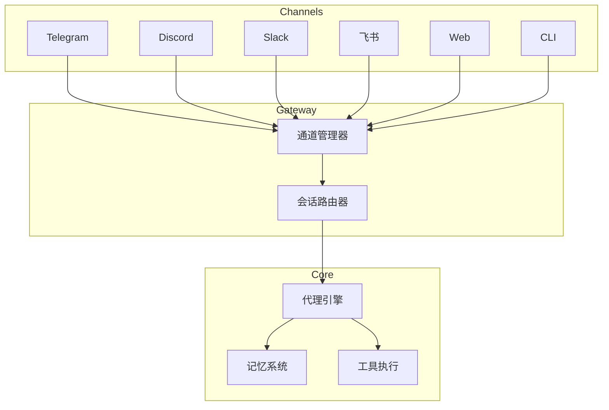

# 消息通道

SecuClaw 支持多种消息通道进行安全操作，让您可以通过首选平台与 AI 安全代理交互。

## 支持的通道

<Columns>
  <Card title="Telegram" href="/channels/telegram" icon="message">
    支持 DM 和群聊的 Bot API。
  </Card>
  <Card title="Discord" href="/channels/discord" icon="hash">
    支持频道消息的 Bot API。
  </Card>
  <Card title="Slack" href="/channels/slack" icon="slack">
    工作区 Socket 模式机器人。
  </Card>
  <Card title="飞书/Lark" href="/channels/feishu" icon="users">
    企业即时通讯平台。
  </Card>
  <Card title="Web" href="/web/console" icon="globe">
    基于浏览器的安全控制台。
  </Card>
  <Card title="CLI" href="/cli" icon="terminal">
    命令行界面。
  </Card>
</Columns>

## 快速设置

### 1. 选择您的通道

每个通道都有特定的设置要求：

| 通道    | 认证方式           | 使用场景               |
| ------- | ------------------ | ---------------------- |
| Telegram | Bot Token          | 个人/群组安全告警       |
| Discord | Bot Token          | 团队安全运营           |
| Slack   | Bot Token + App Token | 企业工作流          |
| 飞书    | App ID + Secret    | 中国企业用户           |

### 2. 配置通道

```bash
secuclaw channels add
```

按照交互式向导配置您选择的通道。

### 3. 启动网关

```bash
secuclaw gateway
```

### 4. 配对设备

默认情况下，新用户必须配对设备：

```bash
secuclaw pairing list <channel>
secuclaw pairing approve <channel> <CODE>
```

## 通用配置

### 私聊策略

所有通道都支持 `dmPolicy` 控制直接消息访问：

- `pairing`（默认）- 用户必须配对设备
- `allowlist` - 仅白名单用户可以发送消息
- `open` - 任何人都可以发送消息（需要 allowFrom 包含 `"*"`）
- `disabled` - 禁用直接消息

### 群组策略

对于支持群聊的通道：

- `open` - 允许所有群组消息
- `allowlist` - 仅允许特定群组/频道
- `disabled` - 禁用群组消息

### 提及要求

控制机器人是否仅在提及时响应：

```json5
{
  channels: {
    telegram: {
      groups: {
        "*": { requireMention: true },
      },
    },
  },
}
```

## 通道功能

| 功能         | Telegram | Discord | Slack | 飞书 |
| ------------ | -------- | ------- | ----- | ---- |
| 私聊消息     | ✅       | ✅      | ✅    | ✅   |
| 群聊         | ✅       | ✅      | ✅    | ✅   |
| 文件附件     | ✅       | ✅      | ✅    | ✅   |
| 流式输出     | ✅       | ✅      | ✅    | ✅   |
| 表情回应     | ✅       | ✅      | ✅    | ⚠️   |
| 话题         | ⚠️       | ✅      | ✅    | ⚠️   |

## 多通道架构



## 通道配置参考

### 通用字段

| 字段              | 描述             | 默认值    |
| ----------------- | ---------------- | --------- |
| `enabled`         | 启用/禁用通道    | `true`    |
| `dmPolicy`        | 私聊策略         | `pairing` |
| `allowFrom`       | 用户白名单       | -         |
| `groupPolicy`     | 群组消息策略     | `allowlist` |
| `textChunkLimit`  | 最大消息长度     | 因通道而异 |
| `mediaMaxMb`      | 最大媒体文件大小 | 因通道而异 |

### 通道专属文档

- [Telegram 配置](/channels/telegram)
- [Discord 配置](/channels/discord)
- [Slack 配置](/channels/slack)
- [飞书配置](/channels/feishu)

## 安全数据源

有关安全数据集成（SIEM、EDR、防火墙），请参阅 [威胁情报](/threat-intel)。

---

_相关文档：[网关配置](/gateway/configuration) | [故障排除](/help/troubleshooting)_
