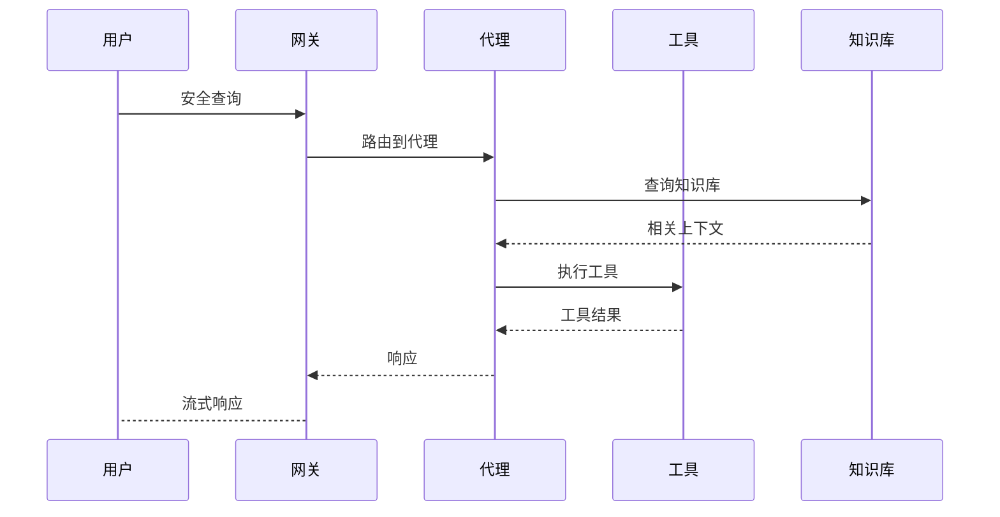

# 架构

最后更新：2026-02-21

## 概述

SecuClaw基于为企业安全运营设计的模块化架构。系统由几个关键组件组成，共同提供全面的安全能力。

## 系统架构

```mermaid
flowchart TB
    subgraph Clients["客户端"]
        CLI[CLI]
        Web[Web控制台]
        API[REST API]
        Webhook[Webhook]
    end
    
    subgraph Gateway["SecuClaw 网关"]
        Router[请求路由]
        Auth[认证]
        Protocol[协议处理]
    end
    
    subgraph Core["核心引擎"]
        Agent[代理引擎]
        Session[会话管理]
        Memory[记忆系统]
        Skills[技能系统]
    end
    
    subgraph Tools["工具与集成"]
        Sandbox[沙盒]
        Tools[安全工具]
        VectorDB[向量数据库]
    end
    
    subgraph Data["数据源"]
        SIEM[SIEM]
        Firewall[防火墙]
        EDR[EDR/XDR]
        Cloud[云安全]
    end
    
    subgraph Knowledge["知识库"]
        ATTACK[MITRE ATT&CK]
        SCF[SCF 2025]
        Intel[威胁情报]
    end
    
    Clients --> Gateway
    Gateway --> Core
    Core --> Tools
    Core --> Data
    Core --> Knowledge
```

## 组件

### 网关（守护进程）

网关是管理所有安全运营的中心枢纽。

**职责：**
- 请求路由和负载均衡
- 认证和授权
- 协议处理
- 会话管理
- 事件处理

**特性：**
- 基于WebSocket的通信
- 可配置端口（默认：21000）
- 基于令牌的认证
- 热配置重载

### 代理引擎

驱动安全运营的核心AI引擎。

**能力：**
- 多模型LLM支持
- 工具执行和编排
- 上下文管理
- 流式响应

**支持的模型：**
- Anthropic Claude
- OpenAI GPT
- Ollama（本地）
- 以及更多通过providers支持

### 会话管理

管理对话会话和上下文。

**特性：**
- 基于JSONL的持久化存储
- 会话压缩
- 上下文修剪
- 多代理隔离

### 记忆系统

用于知识检索的混合搜索记忆。

**特性：**
- 向量相似度搜索（ChromaDB）
- BM25全文搜索
- 混合排名
- 知识图谱支持

### 技能系统

用于自定义能力的可扩展技能框架。

**特性：**
- 动态技能加载
- 技能注册
- 能力发现
- 技能市场（SecuHub）

**架构决策：** SecuClaw使用**8个技能**（而非8个代理）进行角色组合。关于设计原理，请参阅[技能vs代理](/architecture-skills-vs-agents)。

**可视化支持：** 技能可以自带可视化。请参阅[可视化启用的技能](/visualization-enabled-skills)了解详情。

### 沙盒

安全的工具执行环境。

**特性：**
- 基于Docker的隔离
- 资源限制
- 网络策略
- 文件系统限制

### 安全工具

内置安全分析工具。

**类别：**
- 攻击模拟
- 防御评估
- 安全分析
- 漏洞评估

### 知识库

集成的安全知识框架。

**框架：**
- MITRE ATT&CK（企业、移动、工业控制系统）
- SCF 2025（33个安全域）
- STIX 2.1威胁情报

## 数据流



## 部署模式

### 独立部署

适用于小型部署的单个网关实例。

```
┌─────────────────┐
│   网关          │
│   (端口 21000)  │
└─────────────────┘
```

### 集群部署

适用于高可用性的多个网关实例。

```
┌─────────────┐
│  负载        │
│  均衡器       │
└──────┬──────┘
       │
┌──────┴──────┐
│   网关       │
│   节点 1    │
├─────────────┤
│   网关       │
│   节点 2    │
├─────────────┤
│   网关       │
│   节点 3    │
└─────────────┘
```

### 分布式部署

适用于大型企业的分布式部署。

```
┌─────────────────────────────────────┐
│           负载均衡器                  │
└──────────────┬──────────────────────┘
              │
┌──────────────┼──────────────────────┐
│              │                      │
▼              ▼                      ▼
┌──────────┐  ┌──────────┐      ┌──────────┐
│ 区域 1   │  │ 区域 2   │      │ 区域 N   │
│   网关   │  │   网关   │      │   网关   │
└──────────┘  └──────────┘      └──────────┘
```

## 安全

### 认证

- 基于令牌的认证
- Provider的OAuth支持
- API密钥管理

### 授权

- 基于角色的访问控制
- 会话隔离
- 渠道权限

### 数据保护

- 静态加密
- 传输层TLS
- 安全凭据存储

## 运维

- **启动**：`secuclaw gateway`
- **健康检查**：`secuclaw health`
- **日志**：`secuclaw logs`
- **配置**：`secuclaw configure`

---

_相关链接：[配置](/zh-CN/gateway/configuration) · [安全](/zh-CN/security/overview) · [工具](/zh-CN/tools) · [路线图](/zh-CN/ROADMAP)_

---

## 实现状态

| 组件 | 状态 | 备注 |
|------|------|------|
| 网关 | ✅ 完成 | HTTP + WebSocket |
| 代理引擎 | ✅ 完成 | 双循环，16种事件类型 |
| 会话管理 | ✅ 完成 | JSONL持久化 |
| 记忆系统 | ✅ 完成 | 向量 + BM25 + 衰减 |
| 知识图谱 | ✅ 完成 | 4种图谱类型 |
| MITRE ATT&CK | ✅ 完成 | v18.1 STIX数据 |
| SCF 2025 | ✅ 完成 | 33个域已映射 |
| LLM Providers | ⚠️ 36% | 22+中已实现9个 |
| 技能系统 | ⚠️ 80% | 分层不完整 |
| CLI | ⚠️ 60% | 命令为存根 |
| Web界面 | ✅ 95% | 接近完成 |
| 消息渠道 | ⚠️ 部分 | 仅Web完成 |

**总体完成度：约86%**
