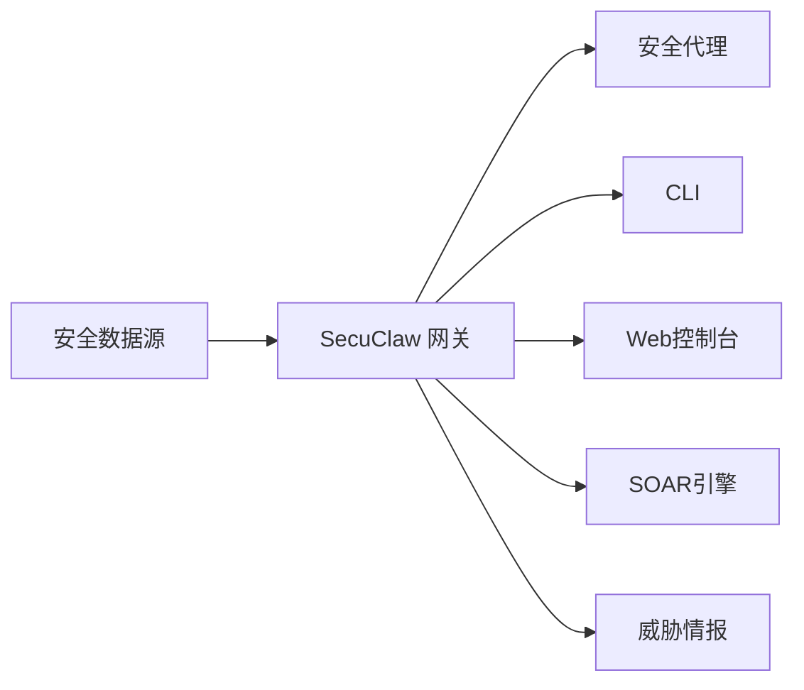

# SecuClaw 安爪安全 🛡️

<p align="center">
    
    
</p>

> _"利爪守护，智御未来"_ — SecuClaw

<p align="center">
  <strong>AI驱动的企业级安全运营平台，具备自主威胁检测、合规管理和安全自动化能力。</strong><br />
  通过AI驱动的安全运营、实时威胁情报和自动化响应工作流保护您的组织。
</p>

<Columns>
  <Card title="快速开始" href="/zh-CN/start/getting-started" icon="rocket">
    在几分钟内安装SecuClaw并设置您的安全运营中心。
  </Card>
  <Card title="安全角色" href="/zh-CN/concepts/security-roles" icon="shield">
    探索针对不同运营需求的专业AI安全代理。
  </Card>
  <Card title="安全控制台" href="/zh-CN/web/console" icon="layout-dashboard">
    启动浏览器仪表板进行威胁监控和事件响应。
  </Card>
</Columns>

## 什么是 SecuClaw？

**SecuClaw（安爪安全）** 是一款AI驱动的企业级安全运营平台，融合20年安全行业经验与前沿AI技术，提供全面的安全运营能力，包括：

- **自主威胁检测**：AI驱动的安全事件分析
- **合规管理**：自动化监管合规监控
- **安全自动化**：SOAR风格的自动化响应工作流
- **威胁情报**：集成全球威胁情报源
- **多角色安全运营**：针对不同安全职能的专业AI代理

**适用对象？** 需要AI助手增强安全运营的企业安全团队、SOC分析师、CISO和合规官。

**与众不同之处？**

- **AI原生**：专为安全运营构建，包含专业AI代理
- **企业级**：SOC 2、ISO 27001就绪架构
- **自托管**：完全掌控您的安全数据
- **多语言支持**：全球部署，支持EN/CN本地化

**需要什么？** Node 22+、API密钥（推荐Anthropic）、5分钟时间。

## 工作原理



网关是安全数据处理、代理编排和事件响应的中心枢纽。

## 核心能力

<Columns>
  <Card title="多代理安全" icon="users">
    专业安全代理：SEC、SEC+LEG、SEC+IT、SEC+BIZ等。
  </Card>
  <Card title="威胁检测" icon="radar">
    AI驱动的实时威胁检测与分析。
  </Card>
  <Card title="合规引擎" icon="file-check">
    自动化合规监控与报告。
  </Card>
  <Card title="SOAR自动化" icon="workflow">
    自动化安全事件响应工作流。
  </Card>
  <Card title="威胁情报" icon="database">
    集成全球威胁情报源。
  </Card>
  <Card title="安全控制台" icon="monitor">
    用于监控和响应的浏览器仪表板。
  </Card>
</Columns>

## 快速开始

<Steps>
  <Step title="安装SecuClaw">
    ```bash
    npm install -g secuclaw@latest
    ```
  </Step>
  <Step title="配置您的环境">
    ```bash
    secuclaw init
    secuclaw configure
    ```
  </Step>
  <Step title="启动安全网关">
    ```bash
    secuclaw gateway --port 21000
    ```
  </Step>
</Steps>

需要完整的安装和开发设置？请查看[快速开始](/zh-CN/start/getting-started)。

## 控制台

网关启动后，打开浏览器安全控制台。

- 本地默认：[http://127.0.0.1:21000/](http://127.0.0.1:21000/)
- 远程访问：[Web界面](/zh-CN/web)和[Tailscale](/zh-CN/gateway/remote)

## 配置（可选）

配置文件位于 `~/.secuclaw/secuclaw.json`。

- 如果**不做任何操作**，SecuClaw使用默认设置和示例安全数据。
- 如果需要自定义，从安全数据源和代理配置开始。

示例：

```json5
{
  security: {
    sources: {
      siem: { enabled: true, endpoint: "https://your-siem.example.com" },
      firewall: { enabled: true, logs: "/var/log/firewall" },
    },
  },
  agents: {
    defaults: {
      model: "anthropic/claude-sonnet-4-5",
    },
  },
}
```

## 从这里开始

<Columns>
  <Card title="文档中心" href="/zh-CN/start/hubs" icon="book-open">
    按用例组织的所有文档和指南。
  </Card>
  <Card title="配置" href="/zh-CN/gateway/configuration" icon="settings">
    核心网关设置、令牌和提供商配置。
  </Card>
  <Card title="安全角色" href="/zh-CN/concepts/security-roles" icon="shield">
    探索专业AI安全代理。
  </Card>
  <Card title="威胁情报" href="/zh-CN/threat-intel" icon="database">
    集成威胁情报能力。
  </Card>
  <Card title="合规" href="/zh-CN/compliance" icon="file-check">
    合规管理与报告。
  </Card>
  <Card title="帮助" href="/zh-CN/help" icon="life-buoy">
    常见问题修复和故障排除入口。
  </Card>
</Columns>

## 了解更多

<Columns>
  <Card title="完整功能列表" href="/zh-CN/concepts/features" icon="list">
    完整安全能力概述。
  </Card>
  <Card title="架构" href="/zh-CN/concepts/architecture" icon="layers">
    系统架构和组件设计。
  </Card>
  <Card title="安全" href="/zh-CN/security/overview" icon="shield-check">
    安全功能和最佳实践。
  </Card>
  <Card title="故障排除" href="/zh-CN/gateway/troubleshooting" icon="wrench">
    网关诊断和常见错误。
  </Card>
  <Card title="关于与致谢" href="/zh-CN/reference/credits" icon="info">
    项目起源、贡献者和许可证。
  </Card>
</Columns>

